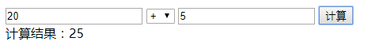

[TOC]

# JavaScript基本语法

## 语言介绍（了解）

### JavaScript的诞生
JavaScript 诞生于 1995 年。由Netscape(网景公司)的程序员Brendan Eich(布兰登)开发的一门脚本语言, 原名叫**LiveScript**。为蹭java热度，最后改名**JavaScript**，并取得非常不错的成绩。


### js版本
>JavaScript这种语言的基本语法结构是由ECMAScript来标准化的, 所以我们说的JavaScript版本一般指的是ECMAScript版本.

* 1996年3月， Netscape公司的浏览器*Navigator2.0*浏览器正式内置了JavaScript
* 1996年8月，微软决定进军浏览器，发布了 *IE 3.0* 并搭载了一个 JavaScript 的克隆版，叫做 **JScript** 
* 1997 年，JavaScript 1.1 作为一个草案提交给欧洲计算机制造商协会（ECMA）

* 1997年7月，ECMAScript 1.0发布。
* 1998年6月，ECMAScript 2.0版发布。
* 1999年12月，ECMAScript 3.0版发布。
* 2007年10月，ECMAScript 4.0版草案想要提交ECMA组织, 但由于4.0版的目标过于激进, 改动太大, 并且微软,谷歌等大公司极力反对；一直到2008年7月ECMA开会决定，中止ECMAScript 4.0的开发（即废除了这个版本）
* 2009年12月，ECMAScript 5.0版正式发布
* 2011年6月，ECMAscript 5.1版发布
* 2015年6月，ECMAScript 6.0正式发布，并且更名为“**ECMAScript 2015**”
* 2016年后，每年发布一个版本


### js语言的组成
> javascript = ECMAScript + BOM + DOM

1. 核心(ECMAScript)
2. 浏览器对象模型(BOM)
3. 文档对象模型(DOM)

### JS和H5的关系
h5全称HTML5,不是单纯的html的第5个版本，而是一项最新的web标准，是html、css、javascript等技术的集合

### 运行行环境
> 与css一样，js必须写在html文档并在**浏览器**中运行

### 编辑工具
* VSCode
* sublime Text
* HBuilder
* Dreamweaver
* Notepad++
* ...

## 基础语法

### js代码的编写位置
* script标签
    ```html
        <script type="text/javascript">
            alert('你好')
        </script>
    ```
* 独立js文件
    > js文件需要引入页面才能执行
    ```html
        <script type="text/javascript" src="js/common.js"><script>
    ```
* script标签属性
    - type: 指定文件类型（默认：`text/javascript`）
    - src : js文件路径
        > 注意：带src属性的script标签内不能写js代码

### 变量的定义
> 格式：`var 变量=数据`，变量：变量是存储数据的容器

```javascript
    // 1、声明并赋值
    //var为<关键字>，age为<变量名>，18为<数据>
    var age = 18;
    
    // 2、先声名后赋值
    var age;
    age = 20;
    
    // 3、一次定义多个变量
    var username="zhangsan", age=18, weight=108;
```

* 变量声明规范:
    * JS变量的命名规范（规定）
        - 变量名必须是数字,字母,下划线`_`和美元符`$`组成;
        - 第一个字符不能为数字
        - 不能使用关键字或保留字

### 输出结果
* alert()：弹窗输出
* console.log()：控制台输出
* 输出到页面元素
    - innerHTML：双标签输出
    - value：表单输出
* document.write() 输出到body内

### JS数据类型
* 值类型
    - Number：数字
        + NaN：是一个特殊的值，即非数值(Not a Number)。数学运算无法得到数字时，就会返回NaN
            * 不代表任何值，也不等于任何值，甚至自己都不等于自己
            * 任何数据与它运算都返回NaN     
    - String：字符串
    >用引号（单/双引号）括起来的内容
    - Boolean: 布尔类型
        + true
        + false
* 特殊数据类型
    - Null
        + null 空值
    - Undefined
        + undefined，声明变量但不赋值则得到 undefined 
* 引用数据类型（后面讲解）
    - Object：对象
        - Array：数组 

#### 数据类型判断typeof
```javascript
    typeof 'html5'; //=>string
    typeof 100; //=>number
    typeof true //=>boolean
    typeof null //=>object
```

#### 数据类型转换
* 基本数据类型转换：利用内置函数进行转换

|值(a)    |转换为 |字符串String(a)|数字Number(a)|布尔值Boolean(a)
|---      |:-----:|----        |----      |----         |
|undefined|=>     |\"undefined\"    |NaN          |false
|null     |=>     |\"null\"         |0            |false
|true     |=>     |\"true\"         |1            |
|false    |=>     |\"false\"        |0            |
|\"\"       |=>     |               |0            |false
|\"1.2\"    |=>     |               |1.2          |true
|\"one\"    |=>     |               |NaN          |true
|0        |=>     |\"0\"            |             |false
|-0       |=>     |\"0\"            |             |false
|NaN      |=>     |\"NaN\"          |             |false
|1        |=>     |\"1\"            |             |true

* 隐式转换
>如果运算不能进行下去，内部就会尝试进行数据类型的转换<br>
支持隐式转换的运算：逻辑运算、关系运算、算术运算

## 运算
> 运算都会得到一个值

### 算术运算：
* +：加
>字符串拼接：+号两侧只要有一个是字符串则为字符串拼接
* -：减
* *：乘
* /：除
* %：取余(取模)

### 赋值运算
* =
`var num1=10;//表示把10赋值给num1变量`
* +=：在原来的内容基础上追加内容
`str += 'test' <==> str = str + 'test'`
* -=：
`var n=10; n -= 2 <==> n = n - 2`
* *=,/=,%=

### 关系运算（得到布尔值）
* 等于：==, ===
>恒等于/全等于，比较的时候要求值和类型都相等（不会进行类型隐式转换）
* 小于：<、<=
* 大于：>，>=
* 不等：!=，!==

>关系运算符的比较规则: 
1.数字和数字比较, 直接比较大小
2.数字和字符串比较, 字符串转换为数字后再比较
3.字符串和字符串比较, 进行字符的**ASCII**码值比较

---

**【案例】**

* 一个引号引发的公司倒闭
* 计算两个文本框的值
* 为抵抗洪水，战士连续作战89小时，编程计算共多少天零多少小时？
>取整：parseInt()

**【练习】**

* 小明要到美国旅游，可是那里的温度是以华氏度为单位记录的。它需要一个程序将华氏温度（80度）转换为摄氏度，并以华氏度和摄氏度为单位分别显示该温度。
>提示：摄氏度与华氏度的转换公式为：摄氏度 = 5/9.0*(华氏度-32)

---


### 逻辑运算（得到布尔值）
* &&: 逻辑与
>&&比||优先级高
* ||：逻辑或
* !: 逻辑非
```
!true //=> false
!false //=> true
```

### 一元运算（得到一个数字）
- ++: 自增1（在原来的数值基础上加1）
- --：自减1（在原来的数值基础上加1）
- 前置：
    ```
    var num = 10;
    ++num;--num;
    ```
    返回值：返回值是减1（加1）之后的值
- 后置：
    ```
    var num = 10;
    num++;num--
    ```
    返回值：返回值是没减1（加1）之前的值


### 八进制和十六进制的介绍（了解）
* 二进制
`var num = 0b10101101;`
* 八进制
`var num = 0o0123`
* 十进制
* 十六进制
`var num = 0xef9302;`

#### 相互转换
* 十进制转其他
```js
    var number = 20;
    number.toString(2); //转成2进制
    number.toString(8);//转成8进制
```

* 其他转十进制
```js
    var x=110;  
    parseInt(x,2); // 6
    parseInt(x,8); // 
    parseInt(x,16);
```

* 其他转其他
先用parseInt转成十进制再用toString转到目标进制

---

**【案例】**

* var k=0; 计算：`k++ + ++k +k +k++`的值
* 猜数字游戏

**【练习】**

* 给定一个三位数，分别把这个数字的百位、十位、个位算出来并显示。
* 判断输入框输入的年份是否为闰年
>能被4整除但不能被100整除，或者能被400整除的才叫闰年

**【作业】**

1. 梳理知识点
>整理笔记，了解当今天讲了些什么
2. 计算两个文本框的加减乘除，并把结果写入第三个文本框

    

**【扩展作业】**

1. 自动计算商品价格

    


---
## 参考资料

### 代码可读性约定
- 标识符区分大小写，如：age和Age是不同的变量。但强烈不建议用同一个单词的大小写区分两个变量。
- 变量命名尽量遵守驼峰原则: myStudentScore
- 变量命名尽量见名知意
- 保持代码缩进
- JS语句的末尾尽量写上分号;
- 运算符两边都留一个空格, 如 `var n = 1 + 2`;
- 注释
    + 单行注释：//注释内容
    + 多行注释（和CSS注释一样）
        * `/*注释内容*/`
        * 多行注释不能嵌套

### 关键字&&保留字
|         |         |            |          |
|---      |-----    |----        |----      |
|break    |do       |instanceof  |typeof
|case     |else     |new         |var
|catch    |finally  |return      |void
|continue |for      |switch      |while
|debugger |function |this        |with
|default  |if       |throw       |delete
|in       |try  

|class   |enum    |extends |super
|const   |let   |export  |import


### 操作符优先级
|运算符|描述
|------|-----|
|., [], ()|对象成员存取、数组下标、函数调用、分组等
|++, --, ~, !, delete, new, typeof, void|一元运算符
|*, /, %|乘法、除法、取模
|+, - |加法、减法、字符串连接
|<, <=, >, >=, instanceof|关系比较、检测类实例
|==, !=, ===, !==|等于、恒等(全等)
|&&|逻辑与
|`||`|逻辑或
|?:|三元运算条件
|=, +=, -=, *=, /=, %=|赋值、运算赋值
|,|多重赋值、数组元素

### 术语
* 表达式的概念: 
    - 由运算符和操作数（变量或常量）组成的式子
    - 算术运算符组成的式子叫算术表达式
    - 关系运算符组成的式子叫关系表达式或者条件表达式
    - 逻辑运算符组成的式子叫做逻辑表达式
>如：2+3；a+5；c>3;  a&&b等
* 返回值：运算后得到的值
* 程序的三大流程控制
>我们的计算机在执行一个程序的时候，最基本的方式是一条语句接一条语句的执行。但不可能所有的问题都能用顺序执行方式就能解决，总会有一些跳转。采用结构化的程序设计，可以大大提高开发程序的速度、提高程序的可读性、程序运行的速度和效率
    - 顺序：从上朝下执行的代码就是顺序
    - 分支(选择)：根据不同的情况，执行对应代码
    - 循环：重复做一件事情


---
## 下节预习
* 语句
    - 条件判断语句
    - 循环语句
