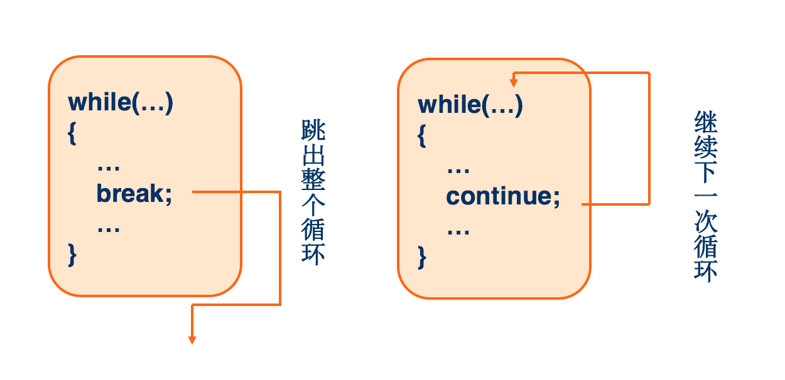

[TOC]

# 语句Statement

## 条件判断语句
### if语句
* if单分支：
```javascript
if(条件){
    //条件成立(返回true)时，执行这里的代码，否则不执行
}
```

* if双分支：
当if括号内的表达式结果成立，执行执行代码1，否则执行执行代码2
```javascript
    if(条件){
        //代码1
        //条件成立(返回true)时，执行这里的代码，忽略以下代码
    }else{
        //代码2
        //条件不成立(返回false)时，执行这里的代码
    }
```

* if多分支：
从上往下，满足哪个条件就执行其相对应的语句，都不满足时，执行最后的else的语句，只能进入其中之一
```javascript
if(条件1){
    //条件1成立(返回true)时，执行这里的代码，忽略以下代码
}else if(条件2){
    //条件2成立(返回true)时，执行这里的代码，忽略以下代码
}
...
else{
    //以上条件都不成立(都返回false)时，执行这里的代码
}
```


### 三元运算
格式：条件 ? 条件成立代码 : 条件不成立代码
```javascript
var a=20;
var b = 50;
var sum = a>b ? a-b : a+b;
```

### switch语句
```javascript
switch(值) {
    case value1: //要求value1与值恒等
        //如果表达式的值恒等于value1，代码从这里开始执行
        break;
    case value2:
        //如果表达式的值恒等于value2，代码从这里开始执行
        break;
    case value3: 
        //如果表达式的值恒等于value3，代码从这里开始执行
        break;
    case value4: 
        //如果表达式的值恒等于value4，代码从这里开始执行
        break;
    default: 
        //如果以上条件都不成立，默认执行这里的代码
}
```

* switch语句在比较值时使用的是全等操作符，因此不会发生类型转换
* case: 当符合条件时，会从符合条件的那一条case语句开始，依次顺序向下执行，直到结束或遇到break
* break: 跳出switch语句
* default: 当所有的case都不满足的情况下会执行defalut下面的语句

---

**【案例】**

1. 判断一个数是偶数还是奇数，并输出判断结果；
2. 求两个数的最大数；
3. 输入月份，显示当月的天数
    * 不考虑闰年
    * 利用case穿透简化代码

**【练习】**

2. 开发一款软件，根据公式（身高-108）*2=体重，可以有10斤左右的浮动。来观察测试者体重是否合适

    

1. 输入成绩，进行成绩判定(要求用if和switch两种写法)
    * 大于85 优秀
    * 大于等于75小于等于85 良好
    * 大于等于60小于75 及格
    * 小于60  不及格

    


**【作业】**

* BMI指数（即身体质量指数，简称体质指数又称体重，英文为Body Mass Index，简称BMI），是用体重公斤数除以身高米数平方得出的数字，是目前国际上常用的衡量人体胖瘦程度以及是否健康的一个标准。主要用于统计用途，当我们需要比较及分析一个人的体重对于不同高度的人所带来的健康影响时，BMI值是一个中立而可靠的指标。
>**成人的BMI数值：**
    - 过轻：低于18.5
    - 正常：18.5-24.99
    - 过重：25-28
    - 肥胖：28-32
    - 非常肥胖, 高于32


    >体质指数（BMI）= 体重（kg）÷身高^2（m）
    如：70kg÷（1.75×1.75）=22.86

---

## 循环语句
* 循环就是重复做一件事,  在JS中指的是循环执行某部分代码.
* 循环结构是程序中一种很重要的结构，其特点是在给定条件成立时，反复执行某程序段，直到条件不成立为止

>只要条件成立，就会不断地执行花括号里的语句
编写条件时，要避免出现死循环

### while循环
```
//变量初始化
while(条件){
    //条件成立就会不断地执行这里的代码，直到条件不成立
    //所以这里一般会伴随着条件的更新
}
```

### do...while
```
//变量初始化
do {
    //不管条件是否成立，先执行一次这里的代码，再进行条件判断，如果条件依然成立，则再次执行这里的代码，依此类推
    //所以这里一般会伴随着条件的更新
} while(条件)
```

### for循环
```
for(变量初始化; 条件判断; 变量更新){
    //循环条件成立，则执行这里的代码
}
```

* 两个分号必须写

**【案例】**

* 打印100以内的奇数
* 小王入职薪水10K，每年涨幅5%，10年后工资多少？
    - 这10年小王赚了多少钱
* 打印出1900年到现在所有的闰年，并以每行四个数的形式输出
* 计算任意数的阶乘n! `1*2*3*4*5...*n`
* 找出所有的水仙花数，三位数，各位立方和等于该数本身。
>如: 153 = 1^3 + 5^3 + 3^3

**【练习】**

* 打印100以内所有偶数的和
* 打印1~100的7的倍数和带7的数
* 打印100–200之间所有能被3或者7整除的数
* 求出1-1/2+1/3-1/4…..1/100的和
* 山上有一口缸可以装50升水，现在有15升水。老和尚叫小和尚下山挑水，每次可以挑5升。问：小和尚要挑几次水才可以把水缸挑满？通过编程解决这个问题。


### 循环跳转
- break：//退出当前整个循环
    + 只能在循环语句中使用
    + 循环体中位于break后的语句不会被执行
    + 在多层循环嵌套中，一个break语句只向外跳一层
- continue：//跳过本次循环，继续下一次循环
    - 只能在循环语句中使用，
    - 跳过本次循环（即跳过循环体中下面尚未执行的代码），接着执行下次循环。
- label：给循环代码添加标识
>break和continue后如果带标识，则跳到标识所在循环

- break与continue的区别（如图）


>PS：

- 知道次数的循环用for循环，不知道次数用while循环
- **死循环**<br>
死循环就是重复执行代码, 不会停止.<br>
死循环会造成程序卡死甚至崩溃等问题, 所以我们写代码要避免死循环

### 嵌套循环
```javascript
for(var i=0;i<10;i++){
    for(var j=0;j<10;j++){
        console.log(i,j);
    }
}
```

---

**【案例】**

* 打印2月份除2和12号中的天数。
* 打印99乘法表
* 生成任意表格


**【练习】**

* 打印三角形
```
*
**
***
****
```
* 求1!+2!+3!+4!+5!...20! 
* 输入两个数，求两个数的最大公约数
>提示: 能够同时整除两个数的最大数  
如: 12和8的最大公约数是4
    + 先找出两个数中最小的那个数, 
    + 最小数-1, 找出能被两个数整除的数(退出循环)

* 输入两个数，求两个数的最小公倍数
如: 9和6的最小公倍数是18
    + 先找出两个数中的最大数
    + 最大数++，找出能整除两个数的数(退出循环)

* 输入两个数n，a，如果n==3， a == 2；
输出 2 + 22 + 222 的值。（不用输出式子）
如: n == 4， a == 3；
输出 3 + 33 + 333 + 3333的值。
提示: 
    + n = 3,相加三次,每次相加比前一次相加的数,多一位
    + 每次多的这个位数的值为`a,  3, 3*10+3, 33*10+3`
 
* 五位数中，对称的数称为回文数，找出所有的回文数。
如: 12321


**【作业】**

* 篮球从5米高的地方掉下来，每次弹起的高度是原来的30%，经过几次弹起，篮球弹起的最终高度小于0.1米
* 宰相的麦子：相传古印度宰相达依尔，是国际象棋的发明者。有一次，国王因为他的贡献要奖励他，问他想要什么。达依尔说：“只要在国际象棋棋盘上（共64格）摆上这么些麦子就行了：第一格一粒，第二格两粒，……，后面一格的麦子总是前一格麦子数的两倍，摆满整个棋盘，我就感恩不尽了。”国王一想，这还不容易，刚想答应，如果你这时在国王旁边站着，你会不会劝国王别答应，为什么？
    - 计算小麦的重量（我国小麦千粒生一般为25-40克）

---
## 下节预习
* 函数


