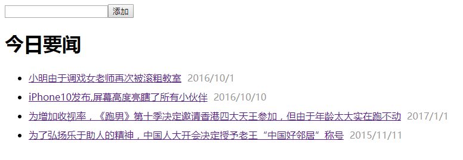

[TOC]

# 日期Date

## 了解时间
* GMT：格林尼治标准时(Greenwich Mean Time)，俗称“天文学时间”
* UTC：协调世界时(Universal Time Coordinated)，“原子物理时间”，它更加精确,50亿年才误差1秒
* 时区：为了克服时间上的混乱，1884年在华盛顿召开的一次国际经度会议（又称国际子午线会议）上，规定将全球划分为24个时区（东、西各12个时区）。规定英国（格林尼治天文台旧址）为中时区（零时区）、东1-12区，西1-12区。每个时区横跨经度15度，时间正好是1小时
* 闰年：四年一闰，百年不闰，四百年再闰
* 纪元时间(UNIX TIME)：`1970-1-1 00:00:00`

## 创建日期时间
```js
	//1）创建当前时间的日期和时间
	var d = new Date();//得到的是代码执行时的时间（本地时间）

	//2）创建指定日期的时间和日期
	var d = new Date("2015/08/22");
	var d = new Date(56521211021);//参数为距1970-1-1零时的毫秒数
```

## 获取/设置时间
* 获取年月日
	- `getFullYear()`/`setFullYear(year)`
	- `getMonth()`/`setMonth(month)`
		> 注意：得到的月份是从0开始的(0-11)
	- `getDate()`/`setDate(date)`
* 获取时分秒
	- `getHours()`/`setHours(hour)`
	- `getMinutes()`/`setMinutes(min)`
	- `getSeconds()`/`setSeconds(sec)`
* 获取星期
	- `getDay()`  0-6:星期天-星期六

## 日期处理
* `getTime()`/`setTime(msec)`：获取/修改某个日期自1970年1月1日0时以来的毫秒数
* `toLocaleDateString()`:  以特定地区格式显示年、月、日
* `toUTCString()`  转换成UTC时间


**ES5方法**

* `Date.parse("2015-08-24")`：返回指定日期距1970-1-1零时的毫秒数
	> PS：转换格式默认支持2015-08-24或2015/08/24
* `Date.now()`：返回执行这行代码时距1970-1-1零时的毫秒数

## 延迟与定时器
* `setTimeout(fn,200)`：两百毫秒后执行fn这个函数（只执行一次）,返回一个id标识
* `clearTimeout(timeoutID)`：清除指定id标识的延迟操作
* `setInterval(fn,30)`：每隔30毫秒执行一次fn这个函数,返回一个id标识
* `clearInterval(intervalID)`：清除指定id标识的定时器操作

```js
	var timer = setTimeout(function(){
		//2s后执行这里的代码
	},2000);

	//清除
	clearTimeout(timer);
```


**【案例】**

* 将当前日期格式化输出为 “2015年08月24 星期五”格式
* 判断两个日期相差的天数
* 封装一个函数`afterDate(date,n)`，得到日期date的n天后的日期
* 使用定时器实现进度条效果
* 秒杀活动倒计时
	- 倒计时结束后显示购买按钮

**【练习】**

1. 轮播图切换
2. 显示当前时间/停留时间
	>显示格式：1时2分23秒
3. 实现秒表功能 : 显示xx时xx分xx秒 , 点击按钮开始计时

**【作业】**

1. 5秒后自动关闭广告
2. 数码时钟


**【扩展】**

1. 滚动最新消息

2. 随机倒计时

----

## 下节预习
* BOM