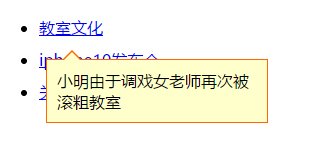

[TOC]

# 事件

## 什么是事件
> 事件是可以被JavaScript侦测到的行为。网页中的每个元素都可以产生某些可以触发JavaScript函数的事件

### 事件绑定方式
> 格式：节点.on+事件类型 = 事件处理函数;
```js
    div.onclick = function(){}
```
当事件被触发时，会执行事件处理函数


### 事件类型

* 鼠标事件
    - onclick         当元素被单击时触发
    - ondblclick      当元素被双击时触发
    - onmousedown     鼠标按钮被按下时触发
    - onmouseup       鼠标按键被松开时触发
    - onmouseover     鼠标移到某元素之上时触发
    - onmouseout      鼠标从某元素移开时触发
    - onmousemove     鼠标被移动时触发
    - onmouseenter      在鼠标光标从元素外部移动到元素范围之内时触发
        > 这个事件不冒泡
    - onmouseleave      在位于元素上方的鼠标光标移动到元素范围之外时触发
        > 这个事件不冒泡，
    - oncontextmenu   鼠标右键菜单展开时触发

    > PS：
        * click = mousedown + mouseup
        * dblclick = click*2(短时间内两次单击)

* 键盘事件
    - onkeydown       某个键盘按键被按下时触发
        > 如果按住不放，会重复触发此事件
    - onkeyup         某个键盘按键被松开时触发
    - onkeypress      键盘<**字符键**>被按下时触发
        > 如果按住不放，会重复触发此事件

* 表单事件
    - onblur      元素失去焦点时触发
    - onfocus     元素获得焦点时触发
    - onchange    元素内容被改变，且失去焦点时触发
    - oninput     输入字符时触发
    - onreset     重置按钮被点击时触发
    - onsubmit    确认按钮被点击时触发
    - onselect    输入框文本被选中时触发

* 页面事件
    - onload      页面元素（包括图片多媒体等）加载完成后触发
    - onscroll    滚动时滚动时触发
    - onresize    窗口或框架被重新调整大小

* 其他事件

## Event对象
> 事件执行过程中的状态，用来保存当前事件的信息对象

### 如何获取event对象
* 标准：事件处理函数的第一个参数
    ```js
        div.onclick = function(e){}
    ```

* IE8-：`window.event`

```js
    //获取event对象的兼容写法
    div.onclick = function(e){
        e = e || window.event;

    }
```
### Event对象详情
* Event公共属性
    - type：被触发的事件的类型(一般用于判断)
    * target: 事件源对象（触发事件的元素）
    - currentTarget: 绑定事件的元素

* 鼠标事件Event属性
    - `button`  返回当事件被触发时，哪个鼠标按钮被点击。 
        + W3C标准
            0: 代表鼠标按下了左键
            1: 代表按下了滚轮
            2: 代表按下了右键
        + IE8-（IE8以下的浏览器）
            1鼠标左键， 2鼠标右键， 3左右同时按， 4滚轮， 5左键加滚轮， 6右键加滚轮， 7三个同时
    * 光标位置信息
        - `clientX`/`clientY` 光标相对于浏览器可视区域的位置，也就是浏览器坐标。  
        - `screenX`/`screenY` 光标指针相对于电脑屏幕的水平/垂直坐标。 
        - `pageX`/`pageY`:鼠标相对于文档的位置
            + 包括滚动条滚动的距离，即：`clientX+window.scrollX`
            + IE8-不支持
        - `offsetX`/`offsetY`: 光标相对于事件源对象的相对偏移量
            + 事件源对象：触发事件的对象
        
* 键盘事件Event属性
    - `which`/`keyCode` 
        - 对于keypress事件，该属性声明了被敲击的键生成的 Unicode 字符码(ascii码) 
        - 对于`keydown`和`keyup`事件，它指定了被敲击的键的虚拟键盘码
            > 虚拟键盘码可能和使用的键盘的布局相关。

    - `altKey`      返回当事件被触发时，ALT 键是否被按下。
    - `ctrlKey`     返回当事件被触发时，CTRL 键是否被按下。 
    - `shiftKey`    返回当事件被触发时，Shift 键是否被按下。 


**【案例】**

* 检测鼠标按键
* 实时显示光标位置
* 制作跟随鼠标移动提示框




* 愤怒的小鸟
    - 键盘实现上下左右移动

**【练习】**

1. 给自动回复机器人添加ctrl+回车发送消息功能
2. 鼠标移入替换图片


3. 输入框默认提示
    - 兼容IE8-


4. 放大镜简单版


**【作业】**

1. 下拉菜单
    * 键盘上下键选择
    * 回车键写入输入框


**【扩展】**

1. 鼠标跟随一连串效果


## 事件传播

### 事件冒泡
>在一个对象上触发某类事件（如onclick事件），那么click事件就会沿着DOM树向这个对象的父级传播，从里到外，直至它被处理程序处理，或者事件到达了最顶层（document/window）

* 事件源对象：触发事件的元素
    > 事件源对象在事件传播过程中不会改变
    - 标准：`event.target`
    - IE8-：`event.srcElement` （了解）

* 停止事件的传播
    - 标准：`event.stopPropagation()`
    - IE8-：`event.cancelBubble = true` （了解）
        - 1）不是所有的事件都能冒泡。以下事件不冒泡：blur、focus、load、unload...。
        - 2）冒泡到最顶层的目标不同。大部分浏览器到window对象，IE8-到document对象

> PS：事件冒泡有利也有弊
* 事件委托：利用冒泡机制把事件绑定到父级，可以大大减少事件数量
* 对结果产生影响：停止事件冒泡

### 阻止浏览器默认行为
* 标准：`event.preventDefault()`;
* IE8-：`event.returnValue = false` （了解）

* 常见默认行为
    * 链接跳转
    * 表单提交
    * 右键菜单...
    * 文本的选择


## 事件监听与捕获(反冒泡)

### 添加事件监听器
> 格式：`元素.addEventListener(事件名,事件处理函数,是否捕获)`
```js
    target.addEventListener("click", fn, false);
```

* 可以绑定多个处理函数在一个对象上, 执行顺序按照绑定的顺序来
    - 不同元素事件执行顺序跟html结构有关
    - 相同元素事件执行顺序跟绑定先后有关
* 第三个参数是否使用捕获(反向冒泡)，默认false，为冒泡

* IE8-的事件监听器（了解）：
    + 格式：元素.attachEvent(on+事件名,事件处理函数)
    `target.attachEvent("onclick",fun);`
    - 可以绑定多个函数在一个对象上, 执行顺序按照绑定的反序

### 移除事件监听器
* 标准：`removeEventListener('click',fn, true)`
    > 传入的所有参数(包括函数)必须与事件监听器中一致，否则不能移除事件

* IE8-：`detachEvent('onclick',fun)`（了解）
    > 传入的参数fun要跟添加时一样，否则不能移除事件


> 注意：
页面事件绑定数量越多，越影响性能（速度越慢）

## 拖拽效果

### 拖拽的原理
鼠标按下且移动鼠标时，改变当前元素的top,left值

### 拖拽的思路
1. 给目标元素添加`onmousedown`事件
    > 拖拽的前提是目标元素设置css定位
    * 记录按下鼠标位置与元素左上角的偏移量
        * ox = offsetX, oy = offsetY
        * ox = clientX-offsetLeft, oy=clientY-offsetTop
2. 当`onmousedown`发生以后，此刻给`document`添加`onmousemove`事件
    > 意味着此刻鼠标在网页的移动都将改变目标元素的位置
    * 在onmousemove事件中，设定目标元素的left和top：
    * 公式
        * 目标元素的left = 鼠标的clientX – offsetX
        * 目标元素的top = 鼠标的clientY– offsetY
3. 给document添加onmouseup事件，清空document的onmousemove事件
    > 意味着拖动过程中鼠标在网页的任意位置松开鼠标，都会放弃拖拽的效果

---

**【案例】**

* 利用事件委托实现新添加的按钮响应点击事件
* 制作自定义右键菜单
* 编写函数封装，解决addEventListener和attachEvent兼容
* 拖拽效果
* 拖拽轨迹回放

**【练习】**

1. 动态创建可编辑的表格
2. 表单提交前数据验证
3. 鼠标移动轨迹

**【作业】**

1. 改变弹窗位置与大小

**【扩展】**

1. 360°全景展示效果
2. 单元格拖拽交换位置


---

# 下节预习
* Cookie