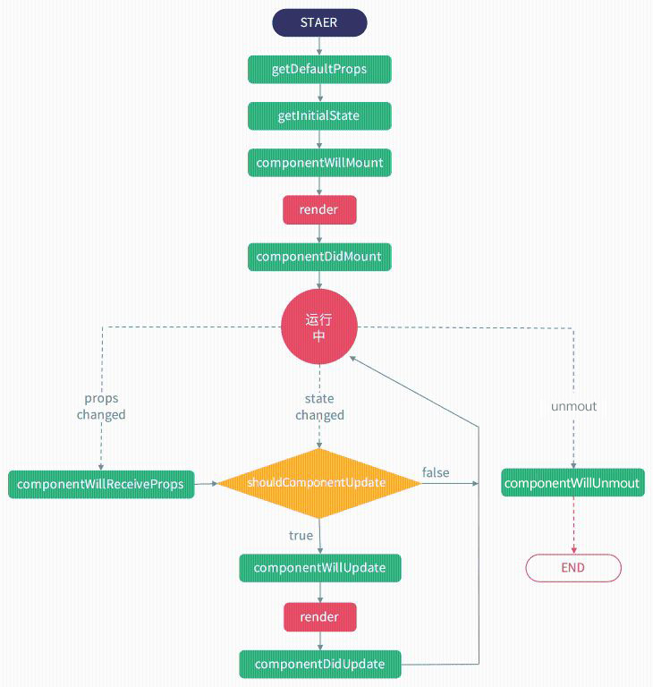

# D1-1

## 1. 了解 React

> React 官网地址：http://facebook.github.io/react/

- 介绍

  > React 是一个视图层的框架，起源于 Facebook 的内部项目，因为该公司对市场上所有 JavaScript MVC 框架，都不满意，就决定自己写一套，用来架设 Instagram 的网站。做出来以后，发现这套东西很好用，就在 2013 年 5 月开源了。由于 React 的设计思想极其独特，属于革命性创新，性能出众，代码逻辑却非常简单。所以，越来越多的人开始关注和使用，认为它可能是将来 Web 开发的主流工具。

- 特点
  - 声明式设计与函数式编程
    > 声明式编程与命令式编程。
    - 声明式：我要做什么，注重结果
    - 命令式：我要怎么做，注重过程
    - 函数式编程：利用函数参数、返回值等去实现功能的编程方式
  - 高性能
    
    > React 通过对 DOM 的模拟(Virtual DOM)，并配合 diff 算法，最大限度地减少与 DOM 的交互，从而提升性能。
  - 组件化开发
    
    > 通过 React 构建组件，使得代码更加容易得到复用，能够**高效率**的应用在大项目的开发中。
  - 单向响应的数据流
    
    > React 中的数据是单向自顶向下传递的，父组件数据的更新会自动传递到子组件，但子组件的数据更新不会影响到父组件，也不能在子组件修改父组件传入的数据
  - JSX 扩展
    
    > JSX 是 JavaScript 语法的扩展。React 开发不一定使用 JSX ，但我们建议使用它。

## 2. 使用 React

1. script 标签引入
   - `react.js` React 的核心库
   - `react-dom.js` 提供与 DOM 相关的功能
   - `browser.js` babel 针对于浏览器环境的版本，可将 JSX、ES6+等语法编译成浏览器支持的代码
     
     > 在浏览器中使用 Babel 来编译 JSX 为实时编译， 效率是非常低的，一般只用于演示
2. 使用

   - 创建虚拟节点：`React.createElement(type,props,children)`
     - type: 节点名称
     - props: 节点属性
     - children: 节点内容
   - 渲染节点：`ReactDOM.render(VNode,target)`
     > 是 ReactDOM 的最基本方法，用于将内容渲染到指定节点中
     - VNode：虚拟节点或 React 组件
     - target：挂载点，必须为元素节点

   ```html
		<script>
			ReactDOM.render(
				React.createElement("div", { className: "container" }, "创建虚拟节点"),
				document.getElementById("app")
			);
		</script>
   ```

> PS：后面会讲解基于 webpack 的使用方式

## 3. JSX 语法

一种**特殊的 js 语法**，是 ECMAScript 的扩展，可以让我们在 js 代码中使用 html 标签来编写结构，避免繁琐的`React.createElement()`操作

> PS：JSX 是`React.createElement()`的语法糖，虽然看起来像 HTML，但严格意义上来说它还是 JS，这种特殊的 JS 浏览器无法识别，所以需要 babel 进行编辑，编辑后它最终会转化成 `React.createElement()`去创建 js 对象。

```html
	<script type="text/babel">
	ReactDOM.render(
		<div className="container">创建虚拟节点</div>,
		document.getElementById("app")
	);
	</script>
```

### 注意：使用 JSX 需要遵循以下规则

- 因为 Javascript 代码与 JSX 代码并不兼容，凡是使用 JSX 的 script 标签都需要加上 `type="text/babel"`
- 在 jsx 代码中，同为 js 关键字的 html 属性不能直接使用
  - class -> className,
  - for -> htmlFor
- 属性使用驼峰
  - tabindex -> tabIndex
  - autofocus -> autoFocus
  - onkeydown -> onKeyDown
  - ......
- 必须结束标签
  ```jsx
      <input type="text" />
      
  ```
- style 属性的值接收一个对象，css 的属性必须为驼峰写法
  ```jsx
    <div style={{backgroundColor:"#f60"}}
  ```
- 花括号`{}`内为 js 表达式，不允许出现 `var`,`let`,`const` 等关键字
- 使用 js 语法注释（如{`/*注释内容*/`}，`//注释内容`）

## 4. React 组件

> 所谓组件，即封装起来的具有独立功能的 UI 部件，用来组合成更高级东西的物件，通俗来讲，就是**创建一个元素**，组件有以下规范：

- 组件名必须大写开头
- 只能包含一个顶层标签


> PS：在开发过程中，要善于观察和抽象。尤其是在项目前期，不要着急写代码，一定要观察项目的原型图或者设计稿，弄懂哪些部分是可以拆分成复用的公共组件的。这样做能让你后面的工作，事半功倍

### 组件的类型与定义

- 函数组件
- 类组件

> 搞懂组件的定义与使用后，更重要的是要学会根据需求组合或拆分更大或更细的组件

#### 函数组件（无状态组件、UI 组件）

> 是一个**纯函数**，只用组件展示，组件只负责根据外部传入的 props 来展示，书写更简洁，执行效率更高（推荐）

```js
    //定义
    function MyComponent(){
        return <h1>函数组件</h1>
    }

    //使用
    <MyComponent />
    <MyComponent></MyComponent>
```

#### 类组件（状态组件、容器组件）

> 类组件有更丰富的特性，如：state 状态、生命周期、this 等

```jsx
	// 定义
	class About extends React.Component {
	render() {
		return <div className="box">类组件</div>;
	}
	}

	// 使用
	<About />;
```

# D1-2

* 整理笔记
* 理解JSX与JS的关系
* 编写一个`Button`按钮组件与一个`List`列表组件


# D1-3

## 从零搭建基于webpack的React环境

### 1. 创建目录结构

* dist
* public
* src
* webpack.config.js
* package.json

### 2. 安装依赖

* react & react-dom
* webpack & webpack-cli & webpack-dev-server
* @babel/core & babel-loader & @babel/preset-react
* html-webpack-plugin

### 3. webpack配置

* entry
* output
* devServer
* loader
  > module.rules
* plugins
* alias
  > resolve.alias

## react 组件的数据挂载方式 

### 1. state：适用于类组件

> React 类组件拥有自己的状态 state，state 状态改变时自动刷新组件（执行组件中的 render 方法）

- 初始 state
	```js
		class MyComponent extends React.Component {
			constructor() {
				super(); // 这行代码不能少哦
				this.state = {
				num: 1,
				};
			}
		}
	```
- 修改状态：`setState()`
  - 直接修改：`setState(nextState[,callback])`
    - nextState: 将要设置的新状态，该状态会和当前的 state 合并
    - callback: 可选参数，回调函数。该函数会在 setState 设置成功，且组件重新渲染后调用。

    ```js
		this.setState({
		num: 10,
		});
    ```

  - 依赖上次`setState()`的结果：`setState(fn [,callback])`
    - fn(prevState)
    ```js
		this.setState((prevState) => {
		return { num: prevState.num + 1 };
		});
    ```
- 注意事项
  - setState()是异步的
	> PS：调用 setState()并不会马上修改 state。而是进入到一个更新队列里面，所以不能在组件内部通过`this.state.xx=xx`直接修改状态，因为修改后会被队列中的 setState()替换（如下两次输出都为 false）
  - 多次`setState()`会自动合并
    > React 内部自动进行 state 的对比，得到最终结果后才渲染视图，所以并不需要担心多次进行 `setState()` 会带来性能问题
  
  ```js
    console.log(this.state.num); //1
    this.setState({
      num: 10,
    });
    console.log(this.state.num); //1
  ```
  
  - `setState()`会自动刷新组件，也可以利用`forceUpdate()`进行手动强制刷新


### 2. props：父组件传入子组件
* 接收方式
	* 函数组件：通过函数的第一个参数访问
	* 类组件：通过`this.props`访问
* 属性类型
	- 普通属性
		```jsx
			<MyComponent data={100} />
		```
- Render Props
    > 使用一个值为函数的 prop 共享代码的简单技术（类似于 Vue 中的**作用域插槽**）

    ```jsx

        // Vue的实现
        // <mycomponent>
        //     <template v-slot:header="data">
        //         <header>头部标题{{data}}</header>
        //     </template>
        // </mycomponent>

        <MyComponent render={data=><header>头部标题{data}</header>} />

    ```

- children

```jsx
    <Button>点我有惊喜</Button>

    // Button组件内获取通过props.children获取"点我有惊喜"
    function Button(){
        return <button>{props.children}<button>
    }
```

* props 类型校验
	> 给组件设置静态属性 propTypes 来设置组件各个属性的类型检查器, 用于限制传入属性的数据类型，在编写组件时比较有用

	- React 内置数据类型检查器 PropTypes
		> 在 React 16 版本之后, PropTypes 从 react 包 分离到了 `prop-types` 包中

		```js
			import PropTypes from "prop-types";
			MyComponent.propTypes = {
				name: PropTypes.string,
			};
		```

	- 自定义属性校验器
		```js
			MyComponent.propTypes = {
				//自定义验证规则
				age: (props, propName, comName) => {
					if (props[propName] < 18) {
					return new Error(propName + "必须大于等于18岁");
					}
				},
			};
		```


### 3. 条件渲染：三元运算
```jsx
	{
		login ? 
		<button>退出</button>
		:
		<button>登录</button>
	}
```

### 4. 列表循环
> 使用数组的 `map()` 方法来创建列表，可配合`filter()`进行过滤操作

* key
    >react利用key来区分组件的
    * key相同，表示同一个组件，react不会重新销毁创建组件实例，只可能更新；
    * key不同，react会销毁已有的组件实例，重新创建组件新的实例
    * key应该是稳定唯一的，尽量不要用数组的索引index作为key（排序或添加时索引值会改变）


### 5. 事件处理
> 事件名称采用驼峰式写法（如：onClick,onKeyDown）

#### event对象与传参
> 事件处理函数的最后一个参数,保存事件发生时的信息

    ```js
        //普通使用
        clickHandle(e){
            console.log(e);
        }
        <button onClick={this.clickHandle}>按钮</button>
    
        // bind方式
        clickHandle(num1,num2,e){
            console.log(num1,num2,e);
        }
        <button onClick={this.clickHandle.bind(this,10,20)}>按钮</button>
    
        // 箭头函数
        clickHandle(e,num){
            console.log(e,num);
        }
        <button onClick={e=>this.clickHandle(e,10)}>按钮</button>
    ```

#### 事件处理函数中的this指向
>默认情况下，事件处理函数没有this指向（值为undefined），可通过以下方式改变this指向

```jsx
    clickHandle(){
        console.log(this);//undefined
    }
    <button onClick={this.clickHandle}>按钮</button>
```


* bind方法
    * 初始化时bind (推荐)
    * 执行时bind
    ```js
        class MyComponent extends React.Component{
            constructor(props){
                super(props);
                this.clickHandle = this.clickHandle.bind(this)
            }
            clickHandle(){

            }
        }
    ```
* 使用箭头函数
    * 定义时使用箭头函数
    ```js
        class MyComponent extends React.Component{
            // 需要插件支持：@babel/plugin-proposal-class-properties
            clickHandle = ()=>{
                
            }
        }
    ```
    * render中使用箭头函数
    ```jsx
        <button onClick={()=>{}}>按钮</button>
    ```

### 6. refs
> 受控组件与非受控组件

* 应用位置
    * 应用在元素节点上：对节点的引用
    * 应用在组件上：对组件实例的引用
    >函数组件不可使用ref
* 适合使用 refs 的情况：
    * 管理焦点，文本选择或媒体播放
    * 触发强制动画
    * 集成第三方 DOM 库
* 设置方式
    * React.createRef()
    * 回调 Refs （推荐）
        
        > `ref={el=>this.myRef=el}`
```js
    // React.createRef()
    this.btnSave = React.createRef();
    <button ref={this.btnSave}>保存</button>
    //获取节点
    this.btnSave.current

    //回调 Refs
    <button ref={el => {this.btnSave = el}}>保存</button>
    // 获取节点
    this.btnSave
```

### 7. 显示html内容
```jsx
    // htmlString为带html标签的内容
    <div dangerouslySetInnerHTML={{ __html: htmlString}}></div>
```

# D1-4
* 练习todolist案列，体会React每个知识点的使用
* 从0配置基于webpack的Vue环境

# D2-1

## 组件通讯

### 1. 父子通讯：props
### 2. 兄弟组件通讯：状态提升
> 把状态放到两个组件共同的父级
### 3. 多层次组件通讯

- props 逐层传递
  > 从上到下，所有的组件都要帮助传递这个 props 到目标位置
  - 缺点：
    - 操作繁琐
    - 难以维护

* context 组件共享

  > 所谓 context，就是**上下文环境**，某个组件只要往自己的 context 里面放了某些状态，这个组件之下的所有子组件都能直接访问这个状态，实现步骤如下：

  1. 创建 Context：
     ```js
     let defaultValue = { username: "laoxie" };
     let MyContext = React.createContext(defaultValue);
     ```
  2. 父组件 Provider
     ```js
         let data = {username:'jingjing'}
         <MyContext.Provider value={data}>
             <App/>
         </MyContext.Provider>
     ```
     > 组件`App`下的所有子组件都能获取到`data`数据，如父组件未设置 Provider，子组件接收时得到 defaultValue 的值
  3. 子组件接收

     - contextType
       
  > 只适用于类组件，通过`this.context`获取
     
     ```js
		SubComponent.contextType = MyContext;
     
     	this.context.username; //jingjing
	```
     
- Consumer
     
     ```js
     <MyContext.Consumer>
       {(value) => {
         // 回调函数中获取value值
       }}
     </MyContext.Consumer>
     ```

## 高阶组件 HOC（High Order Component）

### 理解 HOC

- 高阶组件是一个纯函数
- 高阶组件的参数为组件，返回值为新组件
- 高阶组件是一种设计模式，类似于装饰器模式

### 定义HOC

- 定义方式一： 属性代理
  
  > 作用: 提取公共部分，向下传输 props

```js
//utils/withStorage.js
import React, { Component } from "react";
const withStorage = (WrappedComponent) => {
  return class extends Component {
    componentWillMount() {
      let data = localStorage.getItem("data");
      this.setState({ data });
    }

    render() {
      return <WrappedComponent data={this.state.data} {...this.props} />;
    }
  };
};
export default withStorage;
```

- 定义方式一： 反向继承
  
  > 作用: 拦截生命周期、state、渲染过程等

```js
import React, { Component } from "react";
const withStorage = (WrappedComponent) => {
  return class extends WrappedComponent {
    componentWillMount() {
      let data = localStorage.getItem("data");
      this.setState({ data });

      // 调用父类生命周期函数，使之不被覆盖
      super.componentWillMount();
    }

    render() {
      // 调用父类render方法实现渲染
      return super.render();
    }
  };
};
export default withStorage;
```

### 在组件中使用 HOC

```js
//components/Home.js
import React, { Component } from "react";
import withStorage from "../utils/withStorage";

class Home extends Component {
  render() {
    //通过高阶组件可以直接获取data
    return <h2>{this.props.data}</h2>;
  }
}
export default withStorage(Home);
```

- ES7 装饰器写法: `@`

```js
import React, { Component } from "react";
import withStorage from ".../utils/withStorage";

@withStorage
class Home extends Component {
  render() {
    return <h2>{this.props.data}</h2>;
  }
}

export default Home;
```

> PS：目前浏览器不支持 ES7 装饰器，需安装`@babel/plugin-proposal-decorators`插件


# D2-2

* 组件化todolist案例，并把组件通讯知识运用到案例中


# D2-3

## 组件生命周期

>组件的生命周期分成四个状态：
* Initial: 初始化阶段
* Mounting：挂载阶段
* Updating：更新阶段
* Unmounting：卸载阶段
* 特殊生命周期函数



### 钩子函数

* componentWillMount （不推荐，V17.x版本中将移除）
    
>在组件被渲染到页面上之前执行
    
* componentDidMount 
    >组件被渲染到页面上后立马执行

    - 这个时候是做如下操作的好时机：
        - 某些依赖组件 DOM 节点的操作
        - 发起ajax请求
        - 设置 setInterval、setTimeout 等计时器操作
        - 读取本地存储数据

* componentWillUpdate(nextProps, nextState) （不推荐，V17.x版本中将移除）
    >在初始化时不会被调用，可能在以下两种情况下被调用：
    * 当组件 shouldComponentUpdate 返回 true 且接收到新的props或者state但还没有render时被调用
    * 调用 forceUpdate 时将触发此函数

* componentDidUpdate(prevProps, prevState)
    >在组件完成更新后立即调用。在初始化时不会被调用。

    * 在此处是做这些事情的好时机：
        * 执行依赖新 DOM 节点的操作。
        * 依据新的属性发起新的ajax请求。
        >注意：一定要在确认属性变化后再发起ajax请求，否则极有可能进入死循环：DidUpdate -> ajax -> changeState -> DidUpdate -> ...）

* componentWillUnmount
    >在组件从 DOM 中移除之前立刻被调用。

    * 此处最适合做以下操作
        - 清除定时器、
        - 终止ajax请求


* componentWillReceiveProps(nextProps) （不推荐，V17.x版本中将移除）
    >该方法在以下两种情况下被调用：
    * 组件接收到了新的props属性。新的属性会通过 nextProps 获取到。
    * 组件没有收到新的属性，但是由于父组件重新渲染导致当前组件也被重新渲染。

* shouldComponentUpdate(nextProps, nextState)
    >在props改变或state改变时被调用，必须返回true或false来决定给是否重新渲染组件
    * 在初始化时或者使用forceUpdate时不被调用。
    * 一般用于性能优化

    ```js
         //在render函数调用前判断：如果前后state中num不变，通过return false阻止render调用
        shouldComponentUpdate(nextProps,nextState){
            if(nextState.num == this.state.num){
                return false
            }
        }
    ```

    >PS：这是一个询问式的生命周期函数，如果返回true，组件将触发重新渲染过程，如果返回false 组件将不会触发重新渲染。因此，合理地利用该函数可以一定程度节省开销，提高系统的性能

### react 中性能优化的方案
* shouldComponentUpdate
* PureComponent
与`React.Component`的区别是`PureComponent`内部帮我们做了`shouldComponentUpdate`的简单判断，让state和props不变的情况下自动`return false`，从而实现性能优化

# D2-4
* 整理所学内容，并形成思维导图
* 练习每一个学到的知识点
* 完善todolist案例