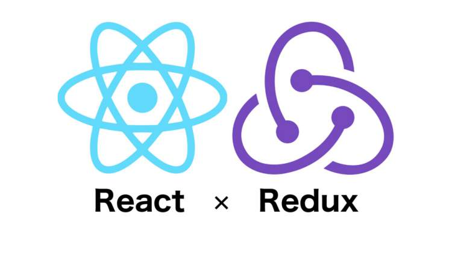
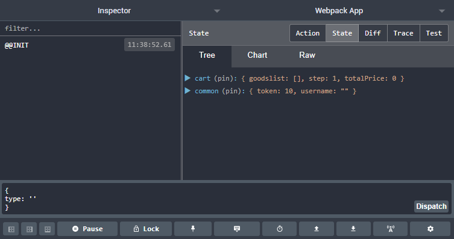

# Redux

##  D1-1

### 概念
* **什么是Redux**：
    > Redux 是一种新型的前端“架构模式”（Flux 架构的一种变种），它不关注你到底用什么库，你可以把它应用到 React 和 Vue，甚至跟 jQuery 结合都没有问题。

* **React和Redux**：
    > 事实上是两个独立的产品，项目中可以使用 React 而不使用Redux ，也可以使用 Redux 而不使用 React 

* **什么是React-redux**：
    > 就是把 Redux 这种架构模式和 React 结合起来的一个库，是 Redux 架构在 React 中的体现，利用这个库能够大大简化代码的书写


### Redux设计和使用的三项基本原则
1. store是必须是唯一的
2. 只有store能改变自己的内容 
    > reducer 可以接受state，但是绝对不能修改state
3. Reducer必须是一个纯函数 
    > 纯函数指的是，给固定的输入，就一定会有固定的输出，而且不会有任何副作用


### 什么时候需要Redux
> Redux作者：如果你不知道是否需要 Redux，那就是不需要它，只有遇到 React 实在解决不了的问题，你才需要 Redux
* 某个组件的状态，需要共享
* 某个状态需要在任何地方都可以拿到
* 在一个组件中需要改变全局状态
* 在一个组件中需要改变另一个组件的状态


### redux 核心 API 

#### 1. 数据存储仓库：Store
> store是Redux存储区（一个保存数据的地方），你可以把它看成一个仓库，规定一个应用只能有一个Store，store中的数据可以被直接访问，但只能通过提供的reducer进行更新。

* 生成数据仓库：`createStore(reducer[,initState][,middleware])` 
```javascript
    import { createStore } from 'redux';
    const store = createStore(reducer);//reducer为一个纯函数，用于设定state修改逻辑（如何修改state中的数据）
```
* 常用方法
    * store.getState() 获取仓库最新状态
    * store.dispatch(action) 修改数据唯一方式
    * store.subscribe(fn) 监听数据修改

#### 2. 数据状态：State
> state为数据状态（快照，即数据在某个时间点的状态），state的改变会触发View改变

```js
    // 获取当前数据状态（对store生成快照）
    store.getState();
```

#### 3. 状态初始化与更新逻辑：Reducer

Reducer 必须是一个**纯函数**，用于指定state修改逻辑，它接受当前 state 和 action 作为参数，并根据state和action的值返回新的state

```js
    //设置默认值
    let defaultState = {goodslist:[],step:0}
    let cartReducer = (state=defaultState,action)=>{
        switch(action.type){
            case 'UPDATE_CART';
                return {...state,goodslist:action.payload}

            default:
                return state;
        }
        
    }

```

> reducer定义好后，可在View中通过：store.dispatch(action) 更新state

* 模块化Reducer
    > 复杂的应用需要使用多个Reducer来实现业务逻辑，把reducer设置成单独模块，并使用`combineReducers`合并成一个大的Reducer后使用
    ```js
        import { createStore,combineReducers } from "redux";

        import productsReducer from './productsReducer';
        import cartReducer from './cartReducer';

        //合并Reducer
        const allReducers = {
            products: productsReducer,
            shoppingCart: cartReducer
        }

        const rootReducer = combineReducers(allReducers);
        let store = createStore(rootReducer);
    ```

#### 4. 状态更新提交：Dispatch
> 修改redux数据的唯一操作

```js
    store.dispatch(action);
```

#### 5. 状态更新提交参数：Action

* 格式：`{type,payload}`
    * type: 一个简单的字符串常量，例如ADD, UPDATE, DELETE等。
    * payload: 用于更新状态的数据。

    ```js
        store.dispatch({type:'UPDATE_CART',num:100});
    ```

##### Action Creator
> 每次编写action对象比较麻烦，可以封装一个函数用于生成action

```js
    export function updateCart(todo){
        return {
            type:'UPDATE_CART',
            payload:todo
        }
    }
```

* bindActionCreators
>利用redux的`bindActionCreators`把`ActionCreator`中默认导出的所有方法(export default中的方法)绑定到组件props并自动**隐式调用dispatch(action)**

```js
    import {bindActionCreators} from redux;
    import {connect} from 'react-redux';
    import ActionCreator from 'actions';

    //...

    MyComponent = connect(state=>state,dispatch=>bindActionCreators(ActionCreator,dispatch))(MyComponent)
    
```


## D1-2
* 整理 redux 学习资料


## D1-3

### 1. 与 react 绑定后使用 redux 实现案例
利用react与Redux结合，实现购物车案例

### 2. react-redux 桥接工具
为了方便使用，Redux 的作者封装了一个 React 专用的库 React-Redux，它提供了一些接口，用于Redux的状态和React的组件展示结合起来，以用于实现状态与视图的一一对应



#### `<Provider/>` 容器组件
* React-Redux 提供Provider组件，接受Redux的store作为props，并将其声明为context的属性之一
* 可结合`connect`方法可以让容器组件方便获取state和dispatch
```js
    ReactDOM.render(
        <Provider store={store}>
            <App/>
        </Provider>,
        document.getElementById('app')
    )
```
#### `connect()`高阶组件
>connect方法为React-Redux核心方法，它把react组件与redux中的Store真正连接在一起，connect方法接受两个参数(Function类型)，用于定义了 UI 组件的业务逻辑，返回容器组件

* 格式：`connect([mapStateToProps],[mapDispatchToProps])`

* mapStateToProps
    >顾名思义，将state中的数据映射到UI组件的props，当state更新的时，会自动执行，重新计算 UI 组件的参数，从而触发 UI 组件的重新渲染
    * 负责组件的输入逻辑，即将state映射到 UI 组件的参数(props)
    * 必须返回一个对象

* mapDispatchToProps
    * 负责组件的输出逻辑，即将用户对 UI 组件的操作映射成 Action
    * 必须返回一个对象

```js
    function mapStateToProps(state,ownprops) {
        //state：redux中的state
        //ownprops: Cart组件自身的props
      return {
        //将state中购物车页面的goodslist数据映射到props，Cart组件中通过props.data访问
        data: state.shoppingCart.goodslist
      }
    }
    function mapDispatchToProps(dispatch,ownprops) {
        // dispatch: redux中的dispatch方法
        // ownprops：同上
      return {
        onChangeQty: action => dispatch(action),
        onRemoveGoods: action => dispatch(action),
      }
    }
    Cart = connect(mapStateToProps,mapDispatchToProps)(Cart);
```
### 3. 容器组件与 UI 组件
根据功能不同，React-Redux 将所有组件分成两大类:

#### 1）UI 组件
* 职责简单，只负责 UI 的呈现，不带有任何业务逻辑
* 没有状态（即不使用this.state这个变量）
* 所有数据都由参数（props）提供
* 不使用任何 Redux 的 API

#### 2）容器组件
* 负责管理数据和业务逻辑，并把数据通过prop传入UI组件（自身不负责 UI效果）
* 带有内部状态
* 使用 Redux 的 API

>React-Redux 规定，所有的 UI 组件都由用户提供，容器组件则是由 React-Redux 自动生成

>如果一个组件既有 UI 又有业务逻辑，那怎么办？解决方案是，将它拆分成下面的结构：
* 外面是一个容器组件，里面包了一个UI 组件。
* 前者负责与外部的通信，将数据传给后者，由后者渲染出视图

### 4. HOC 与 context 通信在 react-redux 底层中的应用 
* `<Provider/>`：利用**Context**共享redux的数据
* `connect()`：使用**高阶组件**把数据作为props传入React组件

## D1-4
* 练习：使用react+redux 完成购物流程案例


## D2-1

### 1. 利用发布订阅模式实现简易 redux 
```js
    function createStore(reducer){
        const state = reducer();
        const listeners = [];
        const getState = ()=>state;
        const dispatch = (action)=>{
            state = reducer(action);
            for (let i = 0; i < listeners.length; i++) {
                listeners[i]()
            }
            return action;
        }
        const subscribe = (listener)=>{
            listener.push(listener)
            return function unsubscribe(){
                var index = listeners.indexOf(listener)
                listeners.splice(index, 1)
            }
        }
        return {
            getState,
            dispatch,
            subscribe
        }
    }
```

### 2. redux 源码与原理解析 

### 3. redux 中间件 
redux中的action仅支持原始对象（plain object），处理有副作用的action，需要使用中间件。中间件可以在发出action，到reducer函数接受action之间，执行具有副作用的操作

#### 中间件的由来与原理、机制 


#### 对 dispatch 改装，实现 redux 异步处理中间件 

#### 常用中间件
* redux-chunk
* redux-promise
* redux-saga
    * Generator生成器函数
        * 返回一个迭代器 Iterator
        * yield
    * Effect
        * call
        * apply
        * put
        * takeEvery
        * takeLatest

#### 使用中间件
1. 利用applyMiddleware接受中间件（可同时接受多个中间件）
2. 通过createStore的第3个参数连接中间件与store

```js
    import {createStore,applyMiddleware} from 'redux';
    
    // 1.引入saga
    import createSagaMiddleware from 'redux-saga';
    
    import rootSaga from './rootSaga.js';

    // 2.创建saga中间件
    const sagaMiddleware = createSagaMiddleware();

    // 3.将 sagaMiddleware 连接至 Store
    let enhancer = applyMiddleware(sagaMiddleware)
    const store  = createStore(reducer,enhancer);

    // 4.引入并运行自定义Saga配置
    sagaMiddleware.run(rootSaga);
```

> 多个enhancer使用redux.compose组合成单个enhancer
```js
    import {createStore,applyMiddleware,compose} from 'redux'
    let enhancer = compose(...enhancer);
    const store  = createStore(reducer,enhancer);
```

#### 利用中间件调式Redux程序

1. 在谷歌应用商店下载redux-devtools
2. 安装redux-devtools-extension
```bash
    npm install -save-dev redux-devtools-extension
```

3. 引入并使用
```js
    // 单独使用
    import {composeWithDevTools } from 'redux-devtools-extension';
    const store = createStore(rootReducer,composeWithDevTools());
    export default store;

    // 与saga一起使用
    import {createStore,applyMiddleware,compose} from 'redux'
    import rootSaga from './rootSaga.js';
    const sagaMiddleware = createSagaMiddleware();

    let enhancer = composeWithDevTools(applyMiddleware(sagaMiddleware))
    // 或使用compose
    // let enhancer = compose(applyMiddleware(sagaMiddleware),composeWithDevTools())

    const store = createStore(rootReducer,enhancer)
    export default store;
```
4. 在Chrome浏览器中调试redux程序




## D2-2
* 查阅源码


## D2-3
### 1. 讲解、复习各类 redux 相关知识的应用场景与原理 
### 2. 利用 react + redux + react-redux 等 redux 技术栈实 现地址选择、购物车等项目功能模块。 

## 2-4
* 结合所学案例，整理本周Redux资料