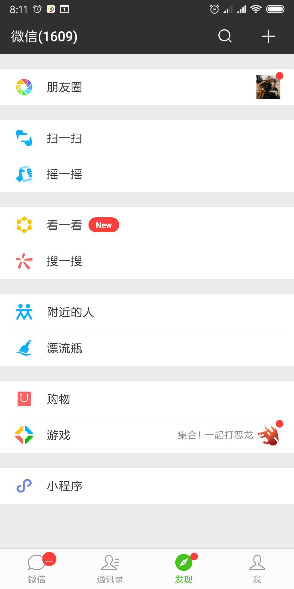
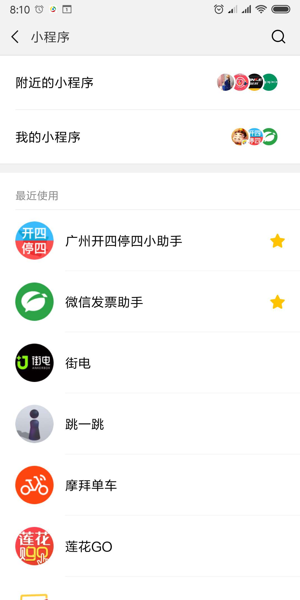
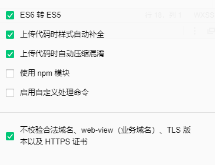

# 小程序

## 分类
* 微信小程序
* 支付宝小程序
* 百度小程序
* 头条（字节跳动）小程序
* QQ小程序

## 发展史

* 2016-09-21	微信小程序内侧
* 2016-11-03	微信小程序公测
* 2017-01-09	微信小程序正式上线
* 2017-09-20	支付宝小程序公测
* 2017-12-28	微信小程序首页下拉入口以及微信小程序上线
* 2018-01	微信小游戏大量推广-跳一跳
* 2018-02	祝福类小程序以及小游戏
* 2018-03	小米、中兴、华为、金立、联想、魅族、努比亚、OPPO、vivo、一加共十家手机厂商、一起推出了快应用，虽然名字不同，本质上也是小程序
* 2018-07	百度小程序上线
* 2018-09-16	头条小程序上线
* 2019-06	QQ小程序上线

## 微信小程序

微信小程序，简称小程序，是一种不需要下载安装即可使用的应用，它实现了应用“触手可及”的梦想，用户无需安装卸载，只需要扫一扫或搜一下即可打开应用，体现了“用完即走”的理念。

* 可申请小程序的主体类型：企业、政府、媒体、其他组织或个人的开发者
* 2016年9月21日微信小程序正式开启内测
* 2017年1月9日0时正式上线

官网：https://mp.weixin.qq.com/

### 优势

* 入口浅：不用安装，即开即用，用完就走，节省安装时间，不占用桌面
* 体验好：对于用户来说，相较于各种APP，微信小程序UI和操作流程会更统一。这也会降低用户的使用难度
* 成本低：相较于原生APP，开发成本更低，推广更容易更简单，让企业节省大量资金、时间、人力，从而做好自己的产品。
* 更快速：体积小（要求不大于2m），可瞬时打开小程序，更省流量

> 进入微信小程序：打开微信->发现->小程序（如没有，则到：我->设置->通用->发现页管理->打开小程序）

### 注册与资料审核
> 可申请小程序的主体类型：企业、政府、媒体、其他组织或个人的开发者
> 一个邮箱只能注册一个微信小程序，一个身份证最多注册5个微信小程序

申请步骤：
1. 打开微信开发平台：https://mp.weixin.qq.com/
2. 根据指引完成注册流程
3. 登录邮箱并激活小程序账号

### 开发准备工作

* 下载微信开发者工具
* 配置小程序基本信息
	> 微信小程序后台 -> 设置 -> 基本设置
	> PS：服务类目一定要跟所做小程序性质一至，否则后期上线无法审核通过
* 配置小程序合法域名
	> 微信小程序后台 -> 开发 -> 开发设置
  
    * 必须为https协议
* 获取小程序appid(小程序开发必备)
	
	> 微信小程序后台 -> 开发 -> 开发设置
* 微信开发者工具勾选项
	> 微信开发者工具安装完成后可根据自身需求进行相应设置

	

### 微信小程序代码构成

#### 所需技术

* html+css+js
* es6
* vue
* react

#### 文件类型

* `.json`   配置文件
* `.js`     逻辑文件
* `.wxss`   样式文件
* `.wxml`   布局文件
* `.wxs`    模块化脚本文件
    > 微信小程序模块化脚本文件，是一种类似于javascript的语言，用来弥补`wxml`中不能操作js中方法的不足，WXS 与 JavaScript 是不同的语言，有自己的语法，并不和 JavaScript 一致。
    * 限制
        * 不能与js互调
        * 不能调用微信api
    * 使用`<wxs/>`
        * module
        * src
        >PS: 一个wxs为一个模块，具有独立作用域，需通过module.exports/exports导出后才能使用

#### 种类

* 全局通用文件
	
	> 根目录下
* 页面级别文件
	
	> pages文件夹下

### 微信小程序生命周期

* onLoad(Object query)

页面加载时触发。一个页面只会调用一次，可以在 onLoad 的参数中获取打开当前页面路径中的参数。

* onShow()

页面显示/切入前台时触发。

* onReady()

页面初次渲染完成时触发。一个页面只会调用一次，代表页面已经准备妥当，可以和视图层进行交互。

	> 注意：对界面内容进行设置的 API 如wx.setNavigationBarTitle，请在onReady之后进行。

* onHide()
页面隐藏/切入后台时触发。 如 navigateTo 或底部 tab 切换到其他页面，小程序切入后台等。

* onUnload()
页面卸载时触发。如redirectTo或navigateBack到其他页面时。

	> 

### 项目上线流程

1. 本地开发
>在微信web开发者工具中进行开发，可在模拟器中编辑和预览

2. 真机调试
>开发者可以通过扫描特定二维码进行预览或真机测试

3. 体验版本
>供开发者和测试人员做上线前的测试工作（需在后台添加体验者权限）

4. 提交审核
>提交给微信进行上线前审核，大概一个工作日左右完成审核

5. 线上版本
>提交上线后，可通过微信小程序入口进行搜索访问

#### 团队开发权限设置：
> 小程序后台 -> 管理 -> 成员管理
* 添加项目成员
* 添加体验成员

### api文档
> 详情请查看官网api文档 https://developers.weixin.qq.com/miniprogram/dev/framework/

* 配置
	* 全局配置
	* 页面配置
* 程序结构
	* App
	* Page
	* Component
	* Module
		> 类似于commonJS模块
* 组件
	* 内置组件
	* 自定义组件
	* 第三方组件
* API接口
	* 客户端
	* 服务端
* 云开发
	* 数据库
	* 云存储
	* 云函数

#### wxml常用语法
* 数据绑定
	* 单向绑定：`{{}}`
		> 属性与标签中都需要使用双花括号
	* 双向绑定：
		* 单向+`bindinput`事件
			> `<input value="{{num}}" bindinput="change"/>`
		* model:value
			> `<input model:value="{{num}}"/>`
* 事件绑定
	* bind/catch
	* event
	* 传参
* 列表循环: wx:for
	* key
	* wx:for-item
	* wx:for-index
* 模板
	* 引入模板文件
		* `<import/>`
		* `<include/>`
	* 定义与使用模板文件
		* `<template/>`

> 详情：[组件与模块化](组件与模块化.md#wow2_3 "template模板")

* 模块化
	* js模块化
		> 遵循`commonJS`规范
	* `<wxs/>`
		* src
		* module
	
> 详情：[组件与模块化](组件与模块化.md#wow2_2 "wxs模块化")