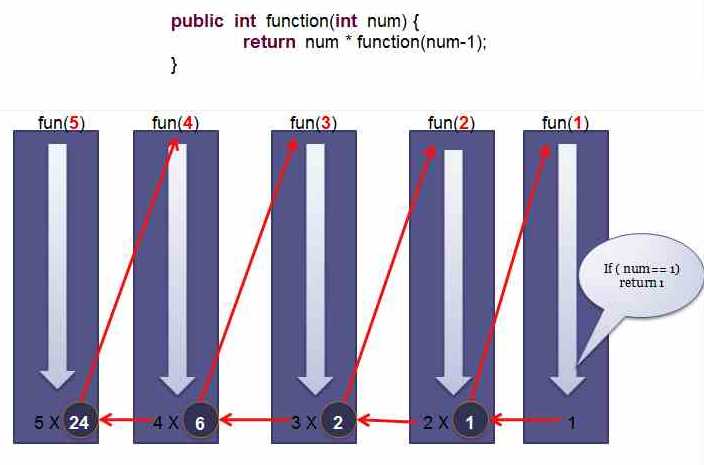
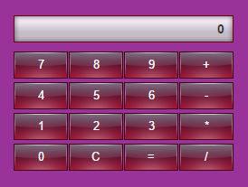

[TOC]

# 函数Function
## 了解函数
函数就是把特定功能的代码抽取出来并进行封装，用来重复执行一些功能，并起个名字（函数名）。函数对任何语言来说都是一个核心的概念。通过函数可以封装任意多条语句，而且可以在任何地方、任何时候调用执行

* 使用函数的好处，为什么要使用函数
    - 函数可以重复执行某一部分代码（通过函数名调用）
    - 使程序变得更简短而清晰
    - 有利于程序维护
* 什么时候需要函数
    - 当相同的代码出现多次时
    - 当需要提取公共代码时 


## 函数的定义
* 关键字声明（声明式）：
    > 格式：`function 函数名(){}`
    ```js
        // 这种方式，函数的声明会提前
        function sum(){}
    ```

* 函数表达式(赋值式)
    ```js
        var sum = function(){}
    ```

* 匿名函数：
    > 没有名字的函数就叫匿名函数

    ```js
        function(){

        }
    ```

> #### 声明提前
* 函数声明提前：函数会提前到所有代码之前，保证在代码执行前可用
* 变量声明提前：变量声明会提前到当前作用域所有代码之前，保证在代码执行前可用
    

## 函数的执行
* 手动调用（主动执行）:
    > 格式：函数名()
    ```js
        sum()
    ```
* 事件驱动（被动执行）:
    > 格式：元素.事件 = 函数名
    ```js
        // button按钮被点击时才会执行sum函数
        button.onclick = sum;
    ```

    > PS：常用事件
    * onclick：点击事件
    * ondblclick：双击事件
    * onmouseover：鼠标移入事件
    * onmouseout:鼠标移开事件
    * onchange：内容改变并失去焦点时事件（一般用于表单元素）
    * oninput:输入内容时触发


## 作用域
> 俗称“**变量使用使用范围**”，即能够使用某个变量的范围，分**全局作用域**和**局部作用域**，主要为了解决命名冲突

* 全局作用域：直接写在`script`标签中或js单独文件中的代码就是全局作用域
    * 页面打开时创建，页面关闭时销毁
    * **全局变量**：在全局作用域下声明的变量，可以在任意地方中使用，作用范围比较大，我们称为全局变量
* 局部作用域：也叫**函数作用域**，写在函数内的代码就是局部作用域
    * 函数执行时创建，函数执行完毕时销毁（每次调用函数都会创建一个独立的作用域）
    * **局部变量**：局部作用域声明的变量，只在函数中可以使用，作用范围较小，我们称之为局部变量

* 变量的访问规则：**就近原则**（如：查找变量`a`）
    1. 先从当前函数查找，有变量a则使用并停止查找，无则进入第2步;
    2. 往父级函数查找，找到则使用并停止查找，无则进入第3步;
    3. 继续往上一层函数查找，依此类推，直到全局作用域，如果在全局作用域还是没找到，则报`not defined`错误;
    
    > **作用域链**：如果存在多个函数嵌套，他们之间就会建立起某种联系，直到全局作用域，这种联系称之为作用域链。当函数访问变量时，根据就近原则在这个作用域链中从内到外查询变量。

---

**【案例]】**

1. 封装一个得到1-100随机整数的函数
2. 封装一个函数factorial，实现任意数字阶乘的计算
    > 要求：页面输入任意数字，点击按钮后计算阶乘
3. 封装一个显示隐藏页面元素的函数
4. 编写生成4位数字验证码的函数，并显示在页面，点击重新生成验证码


**【练习】**

1. 封装一个函数，计算任意两个数字的加减乘除
2. 封装生成表格函数，根据输入的行或列得到一个表格

**【作业】**

1. 编写一个函数，计算任意两个数字之间所能组成的奇数个数，参数数字必须是个位数
比如： 计算0-3之间能组成的奇数是01、21、03、13、23、31
    * 不能单个数字本身进行组合，如11,33


**【面试题】**
1. 以下代码会输出什么？
```js
    var a = 10;
    function test(){
        console.log(a);
        var a=20;
    }
    test();
```

---


## 函数的参数
* 形参：声明函数时的参数
    > 形参是局部变量
* 实参：函数执行时传入的参数
    * 回调函数：把函数作为参数传入

> 形参和实参的数量可以不同

## 函数关键字
* arguments：函数内部隐藏的对象，保存传入的实参信息
    - length: 实参的数量
    - 了解索引值，读取数组中的值


* return: 函数返回值
    1. 终止函数的执行, `return`后的代码不会执行
    2. `return`后如果有值，则把这个值返回到函数执行的地方
    > 如果函数没有return,默认执行完函数所有代码，并返回`undefined`

* this: 当前对象
    > 表示当前对象，而当前对象是谁，取决于谁调用了这个函数

## 函数递归 
> 在函数中调用自己称为递归，递归调用的过程如下: 



## 常用内置函数
> javascript内部自带的函数，不需要定义，可直接使用
* parseInt()
* parseFloat()
* alert()
* Number()
* String()
* Boolean()
* ...

## 函数封装
> 函数封装是每个开发者必备技能

* 提取公共代码
* 封装常用函数

---

**【案例】**

1. 封装一个函数，计算所有传入参数的和
2. 编写一个函数，输入n为偶数时，调用函数求1/2+1/4+...+1/n,当输入n为奇数时，调用函数求1+1/3+...+1/n
3. 封装生成随机颜色函数
4. 利用递归求5的阶乘
5. 递归实现斐波那契数列

**【练习】**

1. 封装计算平方与立方的方法
2. 封装获取某个范围内随机数的方法
3. 根据传进的参数得到最大值

**【作业】**

1. 某个公司采用公用电话传递数据，数据是四位的整数，在传递过程中是加密的，加密规则如下：每位数字都加上5,然后用除以10的余数代替该数字，再将第一位和第四位交换，第二位和第三位交换，请编写一个函数，传入原文，输出密文
2. 年月日分别为自定义函数的参数，判断是否为正确的日期
    > 错误日期：2016-11-31,2017-2-29,2016-13-20,2015-8-38


**【扩展】**

1. 编写一个函数，实现任意参数的大小排列
2. 计算器



---

## 下节预习
* 数组Array
