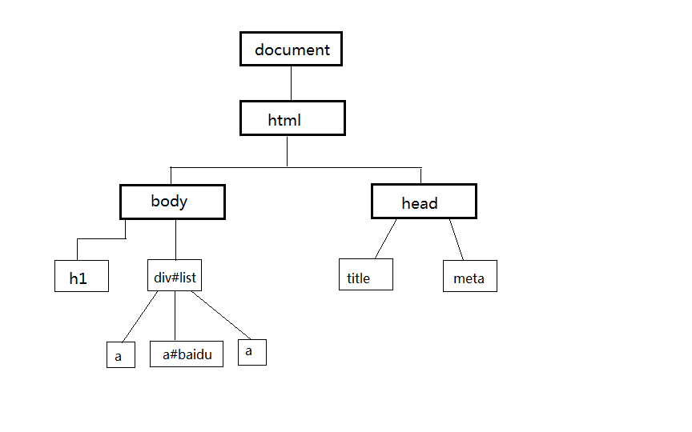
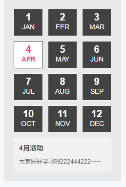

[TOC]

# DOM

## 什么是DOM
`DOM`是Document Object Model（文档对象模型）的缩写，它是W3C国际组织的一套Web标准。是针对HTML和XML文档的一个API，它定义了访问文档**节点**对象的一套属性、方法和事件，浏览器在解析html文档时会把每一个标签渲染也一个节点，并根据层极结构组合成**DOM树**。



## 节点（Node）
> 节点至少拥有`nodeType`、`nodeName`和`nodeValue`三个基本属性。节点类型不同，这三个属性的值也不相同

* nodeName    节点的名称。
* nodeType    节点的类型（共12种类型，常用的有以下3种）
    - 1: 元素节点
    - 2: 属性节点
    - 3: 文本节点
* nodeValue   节点的值
    > 元素节点的nodeValue为null


```html
    <!--找出所有节点-->
    <div class="content" title="属性节点">测试Div</div>
```


## 节点操作

### 获取元素节点
* `document.getElementById(id)`    
    - 通过 ID获取元素的节点（速度最快）
    - 必须通过document调用
    - 返回元素节点对象，如果id不存在返回null
* `getElementsByTagName(tagname)`      
    - 通过标签名获取元素节点列表
    - 返回类数组，如果tagname不存在返回空数组[]
* `getElementsByClassName()`    
    - 通过class类名获取节点列表
    - 返回类数组，如果类名不存在返回空数组[]
* `document.getElementsByName()`          
    - 通过name属性获取元素节点列表
    - 必须通过document调用
    - 返回类数组，如果name属性不存在返回空数组[]

### 节点关系
> 利用节点关系获取其它节点


* 获取父级节点
    * `ele.parentNode`    得到ele元素的父节点 
* 获取子节点
    - `ele.childNodes`    得到ele元素的全部子节点列表（类数组）
    - `ele.firstChild`        获得ele元素的第一个子节点
    - `ele.lastChild`     获得ele元素的最后一个子节点
* 获取兄弟节点
    - `ele.nextSibling`   获得ele元素的下一个兄弟节点
    - `ele.previousSibling`   得到ele元素的上一个兄弟节点


### 节点CRUD
* 创建节点：
    - `document.createElement()`      创建一个元素节点
    - `document.createTextNode()`     创建一个文本节点
    - `document.createAttribute()`    创建一个属性节点（几乎不用）
* 插入节点：
    - `parent.appendChild()`    向节点的子节点列表的结尾添加新的子节点
    - `parent.insertBefore(new,node)`   在指定的子节点node前插入新的子节点new。
    - `node.setAttributeNode(attrNode)`  在指定元素中插入一个属性节点（几乎不用）

* 复制节点： `node.cloneNode(boolean)`     
    > 参数为`true`是深复制。
* 删除节点：`parent.removeChild(node)`  
    > 返回删除的节点
* 判断：
    - `parent.hasChildNodes()`  判断当前节点是否拥有子节点,返回布尔值

> 以上`paren`t表示父级元素，`node`表示节点


**【案例】**

* 动态生成表格并实现隔行变色
* 封装一个删除非元素节点的函数
* 自动应答机器人

**【练习】**

1. 手风琴效果
2. 实现删除表格行效果

**【作业】**

1. 根据数据生成表单
```js
    [{
        label: "用户名",
        name: "username",
        type: "text"
    }, {
        label: "密码",
        name: "password",
        type: "password"
    }, {
        label: "性别",
        name: "gender",
        type: "select",
        value: ['男', '女', '不男', '不女', 'Gay', '妖王']
    }, {
        label: "爱好",
        name: "hobby",
        type: "checkbox",
        value: ['篮球', '足球', '羽毛球', '兵乓球', '爬山', '购物', '旅游', '看美女']
    }, {
        label: '是否已婚',
        name: 'married',
        type: 'radio',
        value: ['已婚', '未婚']
    },
    {
        label: '简介',
        name: 'resume',
        type: 'textarea'
    }];
```


---

## 元素节点的操作 

### 节点属性操作
* 公共属性
    - id           设置/获取元素id属性
    - style        设置/获取元素的内联样式
    - className    设置/获取元素的class属性
    - title
    * ....
* 私有属性
    - name         设置/获取元素name属性
    - value
    - checked
    - type
    - src
    - href
    - seleted
    - ...
* 特殊属性
    - tagName      获取元素元素的标签名
    - innerHTML    设置/获取元素的内容（包含html代码）
    - innerText    设置或获取位于元素标签内的文本
    - outerHTML    设置或获取元素及其内容（包含html代码）
    - outerText    设置(包括标签)或获取(不包括标签)元素的文本
    - ...

* 盒模型相关（只读属性）
    - offsetTop: 当前元素离**定位父级**元素顶部的距离，如无定位父级，则相对于根元素。
    - offsetLeft: 当前元素离<**定位父级**>元素左边的距离，如无定位父级，则相对于根元素。
    - offsetWidth: 当前元素的宽度（border + padding + content）
    - offsetHeight: 当前元素的高度（border + padding + content）

### html属性操作
- ele.getAttribute(attr) 获取元素的属性值（自定义属性获取）
- ele.setAttribute(attr,val) 设置元素的属性
- ele.removeAttribute(attr) 删除属性attr
- ele.hasAttribute(attr) 判断是否存在属性attr

### 元素关系
> 根据元素关系获取其他元素

* parentElement           获取父级节点元素
* children                获取元素的全部子元素
* firstElementChild       获取第一个子元素
* lastElementChild        获取最后一个子元素
* previousElementSibling  获取前一个元素
* nextElementSibling      获取下一个元素

### 获取元素css样式（非内联样式）
> 得到当前元素权重计算后的最终样式

- 标准：getComputedStyle(ele,pseudo) 
    + ele:要获取样式的元素
    + pseudo:伪元素样式字符(可选)，可获取伪元素样式
- IE8-：ele.currentStyle （了解）


---

**【案例】**

1. tab标签页切换
2. 动态生成随机背景色表格

**【练习】**

1. 网页换肤功能
2. 简易日历



3. 自动登录勾选
    * 勾选后，下面的提示信心消失


**【作业】**

1. 全选和反选效果

**【扩展】**

1. 表格即时编辑
2. 密码强度


---

# 下节预习
* 事件Event
