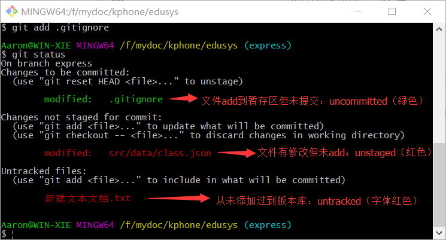

[TOC]

# Git
Git是一个开源的分布式版本控制系统，可以有效、高速的处理从很小到非常大的项目版本管理


## 安装与配置
* 下载与安装
    下载地址：https://git-for-windows.github.io

* 配置个人信息（名字与邮箱）
使用Git的第一件事就是设置你的名字和email,这些就是你在提交commit时的签名
    ```bash
        git config --global user.name "Your Name"
        git config --global user.email "email@example.com"
    ```
    >查看是否配置成功，用命名git config -l

## git的使用（命令行）

### 创建本地仓库
* `git init`：把当前目录变成一个git仓库，并自动创建`master`分支
    >以上命令会在当前目录下创建了一个.git 隐藏目录，它就是Git 仓库。生成仓库后当前目录就不是普通的目录了，我们将其称为**工作区**，所以工作区中都包含一个**git仓库**，而一个git仓库中又包含一个**暂存区**和一个**版本库**

### 工作区与版本库概念


- 工作区（Working Directory）：包含`.git`的目录
- git仓库：工作区有一个隐藏目录`.git`，就是Git仓库。
    + 暂存区（`stage`/`index`）：一个临时的存储区域
    + 版本库 （`repository`）: 代码提交记录存储区


### 添加文件到版本库的步骤（重点）
1. 创建（修改）文件
    > 往工作区中添加/修改文件
2. 添加到暂存区：`git add`
    > 把修改存放到暂存区（只有修改过的文件才能添加）

    * `git add xxx.js`: 添加单个文件
    * `git add src/`：添加一个目录
    * `git add .`：添加所有修改到暂存区
        > 如果想过滤部分文件，请查看 [过滤清单](#git_3)
3. 提交到版本库：`git commit -m "备注"`
    > 使用`git commit` 命令可将暂存区的内容提交至版本库中，这个过程称为提交，每一次提交都意味着版本在进行一次更新（会自动生成一个commit id）

    * 如果不写`-m`就提交会进入vim编辑界面，退出方法：
        1. 退出编辑状态：`ESC`
        2. 同时按下`Shift`和冒号（`:`）
        3. 接着输入输入：`q`（退出不保存），`wq`（保存并退出）

### 其他辅助命令
* 查看仓库变更状态：`git status`
    > 用status查看仓库会有几种状态：untracked、unstaged、uncommitted 

    


## git远程仓库

### 注册登录
* github(国外):https://github.com
* gitlap(国外):https://about.gitlab.com
* gitee(国内):https://gitee.com
* coding(国内):https://coding.net

### 创建远程仓库
> 可以在以上任意网站创建一个远程仓库

### 关联本地仓库与远程仓库
> 有两种方式关联：`ssh`和`https`两种协议，https比较简单，但提交时每次都分输入用户名和密码，如使用https协议，直接跳过以下第1、第2步

1. 创建SSH Key：`ssh-keygen`
以上命令会在windows当前用户的目录里创建`.ssh`目录，里面有`id_rsa`（私钥）和`id_rsa.pub`（公钥）两个文件

2. 添加公钥到Git服务器 
    > 添加完成后测试线路是否连通：`ssh -T git@github.com`

3. 关联本地仓库与远程仓库
    * 添加：`git remote add 远程仓库名 远程仓库地址`
    * 删除：`git remote remove 远程仓库名`
    ```bash
        git remote add origin git@github.com:xxx/view.git
    ```
    > 如没有创建本地仓库，使用克隆命令更简单：`git clone 远程仓库地址`

### 操作远程仓库（重点）
* 推送：`git push`
    > 格式：`git push 远程仓库名 本地分支名:远程分支名`
    把本地分支内容推送到远程分支（远程分支名省略表示推送到与本地分支相同的分支）

    ```bash
        git push origin master
    ```

* 拉取与合并: `git pull`
    > 格式：`git pull 远程仓库名 远程分支名:本地分支名`
    拉取远程分支内容到本地并与本地分支进行合并（本地分支名省略表示合并到与远程分支名相同的分支）

    ```bash
        git pull origin master
    ```
* 拉取：`git fetch`
    > 拉取远程分支内容到本地（不合并）
* 合并：`git merge 分支`
    > 合并分支内容到当前分支

    ```bash
        git pull origin master

        //以上命令相当与以下命令等效
        git fetch origin master
        git merge origin/master
    ```

    >**push和pull后的分支顺序格式：<来源地>:<目的地>

## 版本回退

* 回退命令：`git reset`
    - 回退到上一个版本：`git reset --hard HEAD^`
    - 回退到指定版本：：`git reset --hard [commit id]` 
        > 版本号没必要写全，前几位就可以了，Git会自动去找。
    - 回退指定文件: `git reset --hard [commit id] <file>`
    - 参数说明
        + `--hard`:工作区、暂存区、版本库的文件同时回退
        + `--mixed`（默认）：暂存区、版本库的文件回退
        + `--soft`：仅仅回退版本库中的文件

* 当前版本：`HEAD`
    * 上一个版本：`HEAD^`
    * 上上个版本：`HEAD^^`
    * ...            依此类推
    * 前100个版本：`HEAD~100`

* 显示提交日志：`git log`
    > 一大串类似`3628164...882e1e0`的是**commit id**（版本号）

    * `--pretty=oneline`（显示简要信息id+备注）
    * `--graph`（图形显示版本走向）
    * `--abbrev-commit`（显示简写的id）

* 查看命令历史：`git reflog`

* 撤销文件修改
    - `git checkout -- <file>`：放弃工作区的修改
    - `git rm --cache <file>`：撤销暂存区的修改
    - `git reset HEAD <file>`：撤销暂存区的修改

* 对比文件：`git diff <file>`


## git过滤配置(过滤清单)
> 一般来说每个Git项目中都需要一个“`.gitignore`”文件，这个文件的作用就是告诉Git哪些文件不需要添加到版本管理中。

```
    #过滤dist根目录下的文件（不过滤其他目录下的dist文件夹）
    /dist 

    #过滤所有node_modules文件夹
    node_modules/

    #过滤所有.zip文件
    *.zip 

    #过滤某个具体文件
    /mtk/d.doc
```


## 分支操作（了解）
* 创建分支：`git branch 分支名`
* 切换分支：`git checkout 分支名`
> 以上两步合并为：`git checkout -b 分支名`

* 查看分支：`git branch`
    > 列出所有分支，当前分支前面会标一个*号
* 合并分支：`git merge 分支名`
    - `Fast-forward`：快速合并
    * `--no-ff`: 禁用快速合并（保持分支信息）
    >合并要创建一个新的commit，所以加上-m参数，把commit描述写进去

* 删除分支：`git branch -d 分支名`
    > 强行删除，需要使用命令`git branch -D feature-vulcan`
* 同步远程分支到本地
    1. 先获取（git fetch）
    2. 然后在本地创建一个同名分支,并将远程分支映射到此分支: `git branch dev origin/dev`

## 工作中一个团队标准的分支


* master: 主分支，主要用来版本发布。
* develop：日常开发分支，该分支正常保存了开发的最新代码。
* feature：具体的功能开发分支，只与 develop 分支交互。
* release：release 分支可以认为是 master 分支的未测试版。比如说某一期的功能全部开发完成，那么就将 develop 分支合并到 release 分支，测试没有问题并且到了发布日期就合并到 master 分支，进行发布。
* hotfix：线上 bug 修复分支。

**在实际开发中，我们应该按照几个基本原则进行分支管理：**
首先，master分支应该是非常稳定的，也就是仅用来发布新版本，平时不能在上面干活；

那在哪干活呢？干活都在dev分支上，也就是说，dev分支是不稳定的，到某个时候，比如1.0版本发布时，再把dev分支合并到master上，在master分支发布1.0版本；

你和你的小伙伴们每个人都在dev分支上干活，每个人都有自己的分支，时不时地往dev分支上合并就可以了。

所以，团队合作的分支看起来就像这样：


